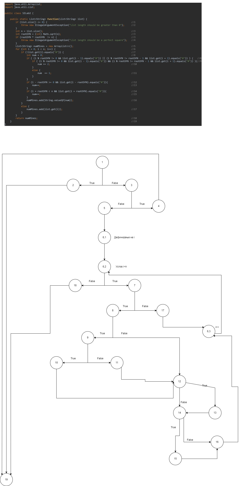

Стефан Марковски 203180

2. Control flow graph

4. Тест случаи според критериумот Every statement

	1)list - празна , vrakja : nisto(exception) , nodes: 1, 2, 19

	2)list = {"0","#","0"} , vrakja : nisto(exception) , nodes: 1, 3, 4, 19

	3)list = {"0","#","0","#","0","#","0","#","#"} , vrakja : {"2","#","2","#","4","#","2","#","#"} , nodes: 1, 3, 5, 6.1, 6.2, 6.3, 7, 8, 9, 10, 11, 12, 13, 14, 15, 16, 17, 18, 19

5. Тест случаи според критериумот Every Branch

	1)list - празна , vrakja : nisto(exception) , branches: 1-2, 2-19

	2)list = {"0","#","0"} , vrakja : nisto(exception) , brances: 1-3, 3-4, 4-19

	3)list = {"0","0","0","#","0","#","0","#","#"} , vrakja : {"1","0","1","#","3","#","2","#","#"} ,  branches: site osven 1-2, 3-4, 2-19, 4-19

6. Објаснување на unit testovite

   6.1 Објаснување на тест случаи според критериумот Every statement

	1) за да поминеме низ statement #2 мора да внесиме празна листа.
	2) за да поминеме низ statement #4 мора да внесиме листа каде корен од n дава децимален број (програмата си го зема како int односно цел број и затоа ќе се исполни условот кај statement #3 кој ќе не донеси до statement #4).
	3) за да имаме минимален број на тестови конструирав листа која ќе ги измине сите останати statements.
  
   6.2
	
	1) за да поминеме низ branch-овите: 1-2 и 2-19 мора да внесиме празна листа.
	2) за да поминеме низ branch-овите: 3-4 и 4-19 мора да внесиме листа каде корен од n дава децимален број (подобро објаснето погоре).
	3) прво ја зедов истата листа 3) од тест случаите според критериумот Every statement но со неа не се изминаа сите branch-ови па затоа малку ја изменив т.ш ќе ги измине сите во интерес на минимален број на тестови.